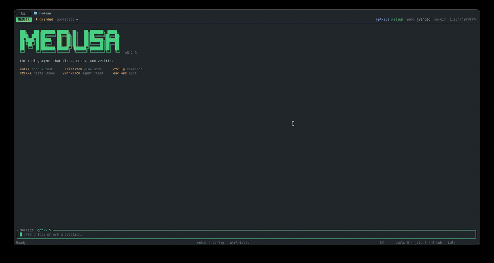

# Medusa

A terminal-native coding agent built around adaptive parallel work. Medusa
gathers evidence across independent heads, converges through one controlled
writer, and verifies the result before calling the task complete.

The Rust TUI keeps that work readable with batched tool activity, inline diffs,
live plans, checkpoints, and permission controls.

<p align="center">
  <a href="docs/assets/medusa-demo.mp4">
    
  </a>
</p>

<p align="center">
  <sub>Live theme preview, command palette, and model/reasoning selection in Ghostty. <a href="docs/assets/medusa-terminal.png">Static preview</a> · <a href="docs/assets/medusa-demo.mp4">Full-quality video</a></sub>
</p>

## Features

- **Adaptive harness:** small tasks stay in the direct loop, uncertain tasks
  explore first, and broad tasks can fan out into a dynamic workflow.
- **Parallel heads, single writer:** independent reads and specialist agents
  run concurrently; mutation is serialized and read-only heads cannot write
  through the terminal.
- **Evidence and convergence:** observations, changed files, and verification
  state follow the turn. Repeated no-progress cycles stop without imposing an
  arbitrary tool-call limit.
- **Safe editing:** native edit and patch tools, inline diffs, automatic
  post-edit checks, per-turn checkpoints, and `/rewind`.
- **Permissioned execution:** `open`, `guarded`, and `readonly` modes with
  explicit approvals and macOS Seatbelt or Linux bubblewrap sandboxing.
- **Purpose-built TUI:** batched tool activity, Markdown and syntax
  highlighting, live plans, image previews, themes, and session navigation.
- **Extensible tools:** web search/fetch, MCP servers, Chrome control, custom
  agents, lifecycle hooks, and JavaScript workflows.
- **Long-running work:** context compaction, persistent sessions, background
  jobs, and a headless `medusa run` mode for scripts and CI.

## Requirements

- A model backend. Codex OAuth is the default; OpenAI Responses,
  OpenAI-compatible services, and local endpoints are also supported.
- Rust 1.90+ only when installing with Cargo or building from source.
- `bubblewrap` for guarded or readonly execution on Linux.
- Chrome, Node.js LTS, and npm only for optional browser control.

## Install

### With Cargo from GitHub

Install the latest tagged release directly:

```sh
cargo install --locked \
  --git https://github.com/jayasuryajsk/Medusa.git \
  --tag v0.3.3 \
  medusa-tui
```

Cargo places `medusa` in `~/.cargo/bin`. If the command is not found after
installation, add that directory to your shell profile and restart the shell:

```sh
export PATH="$HOME/.cargo/bin:$PATH"
```

### From release binaries

Prebuilt binaries for macOS (Apple Silicon and Intel) and Linux (x86_64) are
attached to each [GitHub release](https://github.com/jayasuryajsk/Medusa/releases).
Download the archive for your platform, verify its `.sha256`, and place the
`medusa` binary somewhere on your `PATH`.

### From a source checkout

```sh
git clone https://github.com/jayasuryajsk/Medusa.git
cd Medusa
cargo install --locked --path crates/medusa-tui
```

This builds an optimized binary and places `medusa` on your `PATH` (usually
`~/.cargo/bin`).

## Models And Authentication

By default Medusa authenticates with the **Codex OAuth token** — the same
credentials the [Codex CLI](https://github.com/openai/codex) writes. If you
already use Codex, you're done. Otherwise:

```sh
# install and log in to the Codex CLI once
codex login
```

Medusa reads the token from `~/.codex/auth.json` (override the directory with
`CODEX_HOME`). Inside the TUI, `/auth` shows the active provider, protocol,
endpoint, model, and credential status.

### Using another provider

Models use `provider/model` IDs. Store an API key without putting it in shell
history, then choose the model in `/model` or with `--model`:

```sh
medusa auth list
medusa auth set openai
medusa run --model openai/gpt-5.5 "inspect this repository"

medusa auth set deepseek
medusa run --model deepseek/deepseek-v4-flash "fix the tests"

# Local OpenAI-compatible servers need no credential
medusa run --model ollama/qwen3-coder "review this diff"
```

Keys are stored with private permissions in
`~/.local/share/medusa/auth.json`. Environment variables such as
`OPENAI_API_KEY`, `DEEPSEEK_API_KEY`, and `OPENROUTER_API_KEY` also work.
Stored credentials take precedence. Use `medusa auth remove <provider>` to
delete one.

Built-in adapters cover Codex Responses, OpenAI Responses, and
OpenAI-compatible Chat Completions. The registry includes `codex`, `openai`,
`deepseek`, `openrouter`, `ollama`, and `lmstudio`. Add another compatible
service in `.medusa/providers.json` (or globally in
`~/.config/medusa/providers.json`):

The built-in `deepseek/deepseek-v4-flash` adapter uses DeepSeek's native
Responses API. Custom DeepSeek-compatible Chat Completions providers remain
supported through `protocol: "openai-chat"` and `thinking: "deepseek"`.

```json
{
  "providers": {
    "acme": {
      "name": "Acme AI",
      "protocol": "openai-chat",
      "thinking": "openai",
      "baseUrl": "https://models.acme.example/v1",
      "apiKeyEnv": ["ACME_API_KEY"],
      "defaultModel": "coder",
      "models": {
        "coder": {
          "name": "Acme Coder",
          "reasoning": ["none", "medium", "high"],
          "capabilities": {
            "tools": true,
            "reasoning": true,
            "images": false,
            "parallelTools": true,
            "promptCache": true
          }
        }
      }
    }
  }
}
```

Then run `medusa auth set acme` and select `acme/coder`. Provider files may
override built-ins, add request headers, declare models, and set capabilities;
secrets stay in the credential store or environment rather than project JSON.
For Chat Completions providers, `thinking` may be `openai`, `openrouter`,
`deepseek`, or `none`; this keeps the reasoning picker aligned with the actual
request format.

## Usage

Launch the TUI in any project directory:

```sh
cd ~/code/myproject
medusa
```

Type a task and press **Enter**. **Shift+Enter** (or **Alt+Enter**) inserts a
newline for multi-line prompts. **Esc** interrupts a running turn; **Esc Esc**
on an idle composer quits.

In the composer:

- **`@`** opens a fuzzy file picker and inserts the chosen workspace path into
  your message (Tab accepts, Esc dismisses).
- **`# <note>`** is quick memory: the note is appended under `## Notes` in
  `AGENTS.md` instead of being sent as a turn, so it persists for future
  sessions.
- **`/edit`** opens a picker over your previous messages; choosing one
  truncates the transcript there and lets you edit and resend (the original
  timeline is preserved as a session fork).

### Slash commands

| Command | What it does |
|---|---|
| `/help` | List all commands |
| `/plan` | Toggle plan mode (explore & propose before editing) |
| `/model` | Choose a provider/model and its supported reasoning mode |
| `/reasoning` | Set thinking effort (`low`…`max`) or Ultra proactive orchestration when supported |
| `/permissions` | Change permission mode (open / guarded / readonly) |
| `/theme` | Cycle color themes (`medusa`, `opencode`, `tokyonight`, `catppuccin`, …) |
| `/workflow <task>` | Have the model author and run a task-specific JavaScript workflow |
| `/workflow <script> [args]` | Run a saved `.medusa/workflows/*.js` workflow |
| `/rewind` | Restore files to the state before a previous turn |
| `/edit` | Backtrack: edit a previous message and resend from there |
| `/review` | Seed the composer with a code-review prompt for pending changes |
| `/compact` · `/context` · `/cost` | Compact history now · show context usage · show token and prompt-cache hit usage |
| `/tools` · `/skills` · `/agents` | Show available tools / skills / named agents |
| `/mcp [restart <server>]` | List MCP servers and their tools, or restart one |
| `/sessions` · `/resume` · `/fork` · `/tree` | Manage and branch conversation sessions |
| `/jobs` · `/kill` · `/tail` · `/restart <job>` | Manage background terminal jobs |
| `/exec <command>` · `/patch <path>` | Run a shell command · apply a unified diff |
| `/settings` · `/auth` · `/clear` · `/reload` | Settings (incl. the bell toggle), auth status, clear, reload |

Resume your last session in a workspace:

```sh
medusa continue
```

### Headless mode

Run a single non-interactive turn — useful for scripts and CI:

```sh
# task as an argument
medusa run "summarize what this crate does"

# task from stdin
echo "list the public API of this module" | medusa run

# machine-readable output
medusa run --json --permission readonly "audit error handling"
```

Options: `--model <provider/model>`, `--permission <open|guarded|readonly>`, `--json`,
`--no-stream`.

## Configuration

Medusa reads project instructions from an `AGENTS.md` file at the workspace root
(falling back to `AGENT.md`, `CLAUDE.md`, then `MEDUSA.md`). Fresh workspaces
start in `guarded` mode; use `/permissions` to switch between `open`,
`guarded`, and `readonly`.

Project state lives under `.medusa/`. Keep that directory in `.gitignore`
because it can contain prompts, source excerpts, and model output.

The complete reference covers:

- sandboxing and permission modes
- checkpoints and rewind
- MCP servers and Chrome control
- custom agents and lifecycle hooks
- provider, workflow, context, and UI environment variables

See [Configuration](docs/configuration.md).

## Development

```sh
cargo fmt --all -- --check
cargo clippy --locked --workspace --all-targets -- -D warnings
cargo test --locked --workspace
cargo build --locked --release
```

The workspace has two crates: `medusa-core` (agent loop, tools, model backends,
workflow engine) and `medusa-tui` (the terminal interface and headless CLI).

## License

MIT © Jaya Surya Kommireddy. See [LICENSE](LICENSE).

Security reports are handled through [GitHub private vulnerability
reporting](SECURITY.md). Please do not open a public issue for a suspected
credential leak or sandbox escape.
